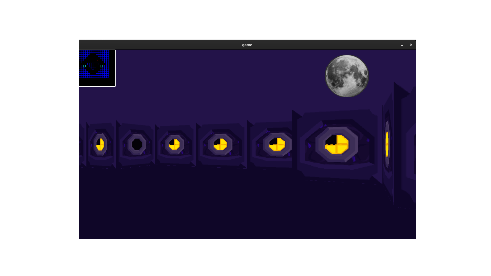
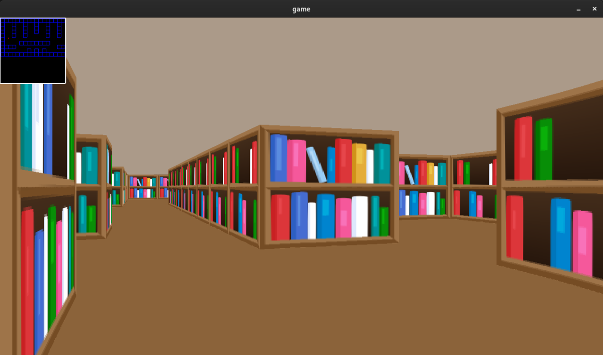

# 🎮 cub3D | 42 Amman

## 📖 Project Overview

**cub3D** is a 42 School project recreating a basic **3D game engine** using **raycasting** — the same technique behind early 90s shooters like **Wolfenstein 3D**.  
This project introduces essential concepts in **graphics rendering**, **event-driven programming**, and **3D projection math**, all while following strict **C coding standards**.

> 🎉 **Final Grade: 125/100 (with bonus)**  

---

## 🎯 Project Objectives

- Master window and image management with **MiniLibX**.
- Implement raycasting for pseudo-3D visualization.
- Apply trigonometry and vector math for projections.
- Handle textures, colors, and real-time rendering.
- Parse and validate custom `.cub` configuration files.
- Ensure clean memory management and Norm compliance.

---

## 🛠️ How to Run

### 📥 1. Clone the Repository  
```bash
git clone https://github.com/sbibers/cub3d.git
cd cub3d
```

### 📦 2. Install Dependencies  
To run the project, make sure you have the necessary dependencies installed:

- **CMake** (for building the project)
  ```bash
  sudo apt-get install cmake
  ```
- **MiniLibX** (for graphics rendering)
  - Install required libraries:
    ```bash
    sudo apt-get install libx11-dev libxext-dev libmlx5-dev
    ```
- **GLFW** (for window management)
  ```bash
  sudo apt-get install libglfw3 libglfw3-dev
  ```
- **OpenGL** (for 3D rendering)
  ```bash
  sudo apt-get install libopengl-dev
  ```

> **Note:** Ensure you have all the necessary dependencies for your operating system. If you're using **macOS**, you can use **Homebrew** to install the necessary libraries.

### 🏗️ 3. Build the Project  
```bash
make
```

### 🎮 4. Launch the Game  
```bash
./cub3D maps/good/your_map.cub
```

---

## 📄 Map File Format

A `.cub` map file contains:

- **Texture paths**
  ```
  NO ./textures/north_texture.png
  SO ./textures/south_texture.png
  ```
- **Floor and Ceiling colors**
  ```
  F 220,100,0
  C 225,30,0
  ```
- **2D Map Grid**
  - `1` → Wall  
  - `0` → Empty space  
  - `N`, `S`, `E`, `W` → Player start position & orientation  
  - `D` → Door (Bonus)

**Example**
```
11111
10001
10N01
11111
```

---

## 🎮 Controls

| Key          | Action                  |
|:-------------|:------------------------|
| `W` `A` `S` `D` | Move player             |
| `←` `→`       | Rotate view              |
| `ESC`         | Exit game                |
| Close window  | Cleanly exit             |

---

## 🚀 Features

✅ Raycasting-based 3D rendering  
✅ Realistic 3D maze visualization  
✅ Smooth window management (resizing, minimizing)  
✅ Textures changing based on wall orientation (North, South, East, West)  
✅ Customizable floor and ceiling colors  
✅ Player movement using `W`, `A`, `S`, `D` keys  
✅ View rotation using `←` `→` arrow keys  
✅ Interactive minimap overlay  
✅ Doors that open and close (Bonus)  
✅ Mouse-based point of view rotation  

---

## 📂 Project Structure

```
cub3D/
├── inc/            # Header files
├── libft/          # Custom C library
├── MLX42/          # MiniLibX library
├── maps/           # .cub map files
├── src/            # Project source files
├── textures/       # Wall textures
├── obj/            # Compiled objects
├── Makefile
└── README.md
```

---

## 🖼️ Screenshots

  


---

## 📌 Author

👤 [Salam Baybars](https://github.com/sbibers)  
📍 42 Amman  

---

## ⭐️ If you like this project, leave a star ⭐️!
